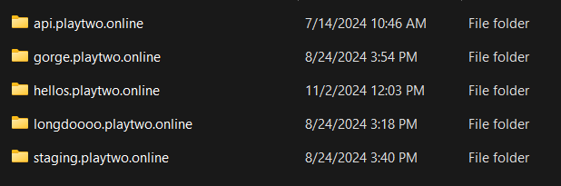

# This bat file will generate privkey.pem + cert.pem

requirements
* download certbot and install
- this link [https://certbot.eff.org/](https://certbot.eff.org/)
* make port 80 is open

if everything is all set
run gen.bat
gen_fake.bat for saving quota

files will export to certbot folder
